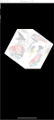

# Flutter 's memo 2019

Update https://github.com/kyorohiro/memo_flutter

# License
## Aclonica.ttf
https://github.com/google/fonts/blob/master/apache/aclonica/Aclonica.ttf

## Other
https://creativecommons.org/publicdomain/zero/1.0/

# Memo
## About RenderObject
./lib/renderobject/*

#### ./lib/renderobject/anime_rect.dart
./lib/renderobject/anime_rect_scheduller.dart

#### ./lib/renderobject/demo_3d_at_drawvertexs.dart

#### ./lib/renderobject/render_object_widget_in_stateless_at_3d.dart

#### etc

